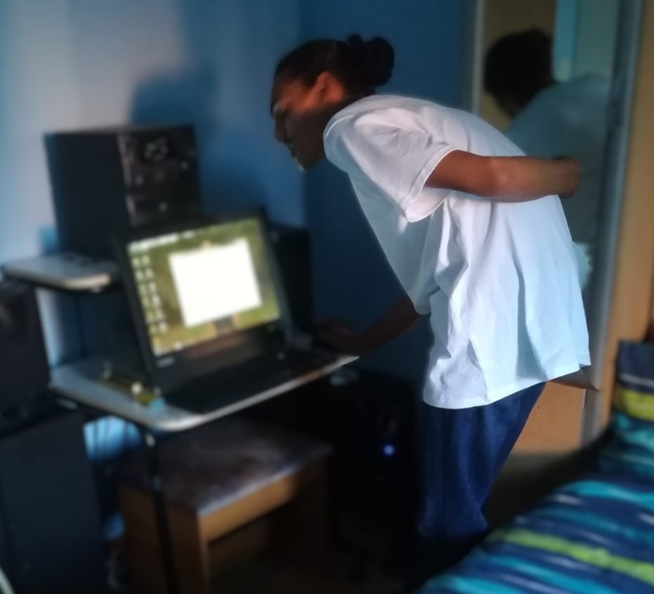

# TheBeginning

## Where my coding journey began... (2019)

Not much to see here... Just thought I could display where my coding journey all began.
And it all started when I came across this YouTube video: 
[Learn Python - Full Course for Beginners [Tutorial]](https://www.youtube.com/watch?v=rfscVS0vtbw)

## Context
**Take note that this is all BARE basics!!!**

## PythonBasics
- I guess all programmers really do begin their Journey with `Hello World`
- `Strings.py` was about understanding what a String is as well as a few built in String functions
- `Numbers.py` was about learning the different numeric possibilities such as whole numbers, decimals, math module, as well as a few built in Numeric functions
- `Stings2.py` was to visualise indexing with zero being the first index
- `Variables & Data Types.py` was about learning how to concatenate various variables
- `Getting Input From Users.py` I remember when I first did this, my mind was blown because I've always wondered how that worked
- `Building A Basic Calculator.py` My first calculator can only perform addition calculations

## PythonLogic
- `if Statements.py` this was about understanding the basic if-else logic
- `if Statements & Comparisons.py` was about numeric if-else logic
- `While Loop.py` I had fun playing around with this one especially the never-ending loop
- `Dictionaries.py` was about understanding the dictionary with key-value pairs
- `Advanced Calculator.py` My first fully functional calculator with addition, subtraction, multiplication, and division

## GettingToKnowPythonBetter
- `Tuples.py` was about understanding that tuples are immutable
- `Lists.py` was about the possibility of storing multiple different values into one container
- `List Functions.py` was about a few built in List functions
- `Functions.py` was about my first basic user-defined function with parameters
- `Return Statement.py` was about returning a value from a function